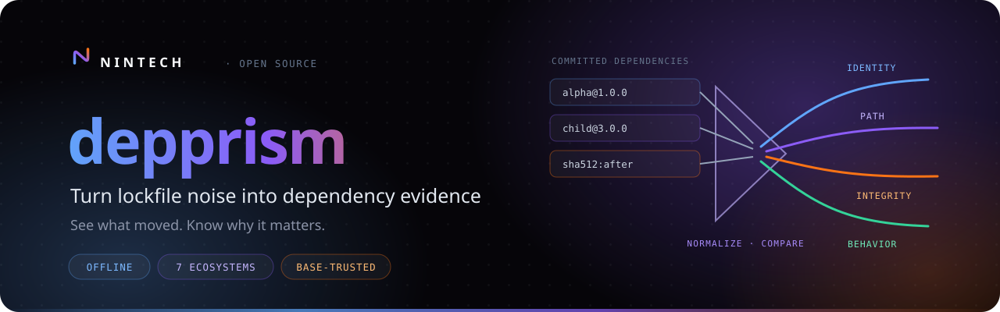
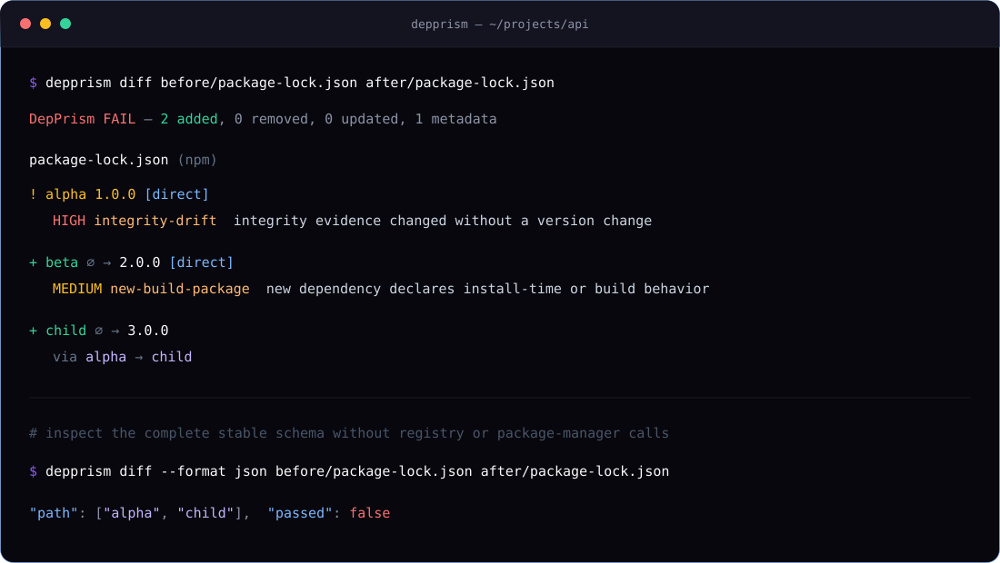
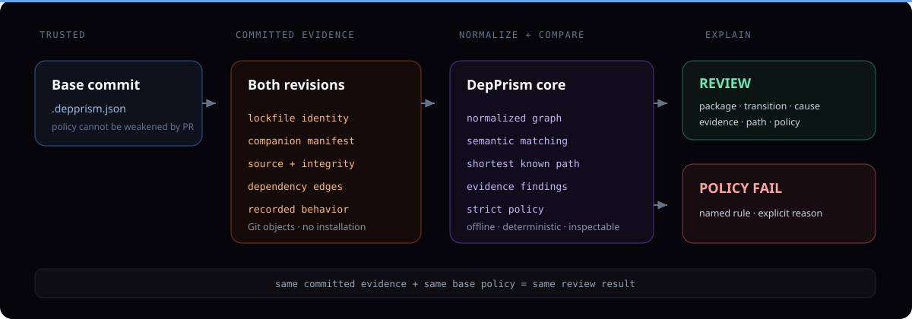

<p align="center">
  
</p>

<p align="center">
  <a href="https://github.com/nintechio/depprism/actions/workflows/ci.yml"></a>
  <a href="https://github.com/nintechio/depprism/releases"></a>
  <a href="https://pkg.go.dev/github.com/nintechio/depprism"></a>
  <a href="LICENSE"></a>
</p>

<p align="center">
  <a href="#quick-start">Quick start</a> ·
  <a href="docs/ecosystem-evidence.md">Ecosystem evidence</a> ·
  <a href="docs/policy.md">Policy</a> ·
  <a href="docs/security-model.md">Security model</a> ·
  <a href="CONTRIBUTING.md">Contributing</a>
</p>

DepPrism turns generated lockfile churn into a deterministic review of what actually changed:

- which packages were added, removed, or updated;
- whether the dependency is direct or transitive;
- the shortest known path that introduced a transitive package;
- source and integrity changes without a version change;
- newly recorded install/build behavior;
- policy failures that can safely block a pull request.

Analysis is local and offline. DepPrism does not execute a package manager, contact a registry, upload a lockfile, send telemetry, or use a model. It reads committed dependency evidence and Git objects only.

<p align="center">
  
</p>

## Quick start

Add the GitHub Action:

```yaml
name: DepPrism
on: [pull_request]

permissions:
  contents: read

jobs:
  dependency-evidence:
    runs-on: ubuntu-latest
    steps:
      - uses: actions/checkout@v7
        with:
          fetch-depth: 0
      - uses: nintechio/depprism@v1
```

A full checkout is required so the Action can read both commits. On pull requests, the base SHA comes from GitHub's event payload and `.depprism.json` is read from that trusted base commit. A pull request cannot approve itself by weakening its own policy.

Optional policy:

```bash
cp .depprism.example.json .depprism.json
```

The built-in policy fails only on same-version source or integrity drift. New Git sources and build-capable packages are still reported; enable the corresponding deny rules when the repository is ready to enforce them.

## Supported evidence

| Ecosystem | Primary file | Companion evidence |
|---|---|---|
| npm | `package-lock.json`, `npm-shrinkwrap.json` | root package record |
| pnpm | `pnpm-lock.yaml` | importer records |
| Yarn Classic / Berry | `yarn.lock` | `package.json` |
| uv | `uv.lock` | `pyproject.toml` |
| Poetry | `poetry.lock` | `pyproject.toml` |
| Cargo | `Cargo.lock` | `Cargo.toml` |
| Go modules | `go.mod` | `go.sum` |

Every parser produces the same normalized graph. Missing evidence is surfaced as a warning instead of being guessed. The precise evidence and limitations for each format are documented in [ecosystem evidence](docs/ecosystem-evidence.md).

## Install the CLI

With Go 1.22 or newer:

```bash
go install github.com/nintechio/depprism/cmd/depprism@latest
```

Or download a release archive and verify `checksums.txt` and its GitHub artifact attestation.

Review two local lockfiles:

```bash
depprism diff --format text before/package-lock.json after/package-lock.json
depprism diff --format json --policy .depprism.json before/uv.lock after/uv.lock
```

Review every supported dependency file changed between Git revisions:

```bash
depprism git --base origin/main
depprism git --base origin/main --format markdown
```

Inspect one normalized graph:

```bash
depprism inspect uv.lock
```

Exit `0` means the review passed. Exit `1` means analysis completed and policy failed. Exit `2` means the input, configuration, Git state, or output could not be evaluated safely.

## Policy example

```json
{
  "$schema": "https://raw.githubusercontent.com/nintechio/depprism/main/policy.schema.json",
  "fail_on": ["integrity-drift", "source-drift"],
  "max_added": 20,
  "deny_new_git_sources": true,
  "deny_new_build_behavior": true,
  "allowed_source_prefixes": [
    "https://registry.npmjs.org/",
    "https://pypi.org/",
    "https://proxy.golang.org/",
    "registry:npm",
    "registry:pypi",
    "registry:yarn"
  ],
  "allowed_packages": []
}
```

Unknown fields, duplicate entries, invalid finding codes, negative limits, and trailing JSON fail closed. See the [policy reference](docs/policy.md) before enabling a source allowlist across multiple ecosystems.

## Use as a Go library

The parser, normalized graph, comparison engine, policy decoder, Git reviewer, and renderers are public APIs:

```go
before, err := depprism.Parse("package-lock.json", beforeBytes, depprism.ParseOptions{})
if err != nil {
    return err
}
after, err := depprism.Parse("package-lock.json", afterBytes, depprism.ParseOptions{})
if err != nil {
    return err
}
report, err := depprism.Compare(before, after, depprism.DefaultPolicy())
```

Companion files such as `package.json` or `pyproject.toml` are supplied through `ParseOptions.ReadFile`, which makes the library usable with a filesystem, Git object database, archive, or in-memory test fixture.

## Deliberate boundaries

<p align="center">
  
</p>

DepPrism is not a vulnerability scanner and does not claim a package is safe, vulnerable, or malicious. Offline analysis cannot know current registry advisories, maintainer identity, or whether an artifact is trustworthy. It reports changes in the evidence your repository committed so a person or a separate security system can make that decision with less noise.

It also never runs install scripts. Build behavior is reported only where a lock format records it; other ecosystems return an explicit evidence warning.

## Documentation

- [Ecosystem evidence and limitations](docs/ecosystem-evidence.md)
- [Policy reference and rollout](docs/policy.md)
- [CLI and machine-readable output](docs/output.md)
- [Practical integration recipes](docs/recipes.md)
- [Architecture and normalized graph](docs/architecture.md)
- [Threat model and trust boundaries](docs/security-model.md)

## Community

Focused parser fixtures, false-positive reports, and integrations are welcome. Please read [CONTRIBUTING.md](CONTRIBUTING.md), the [community guidelines](CODE_OF_CONDUCT.md), and [SECURITY.md](SECURITY.md) before reporting sensitive issues.

MIT © [Nintech Ltd](https://nintech.io)
